| Code Files | Outputs |
|------------|---------|
|['first.m'](./Codes/first.m)|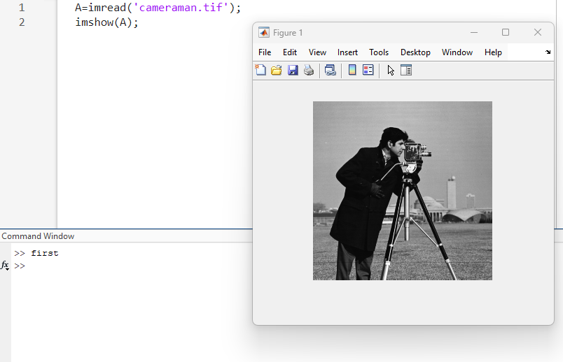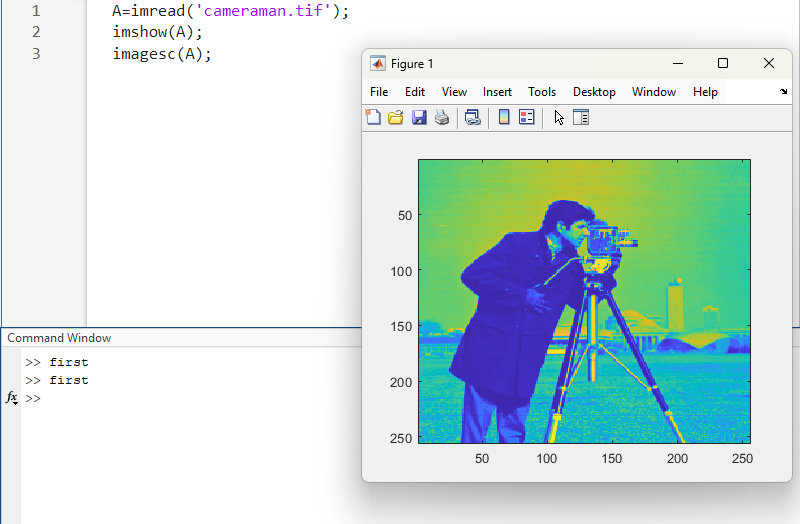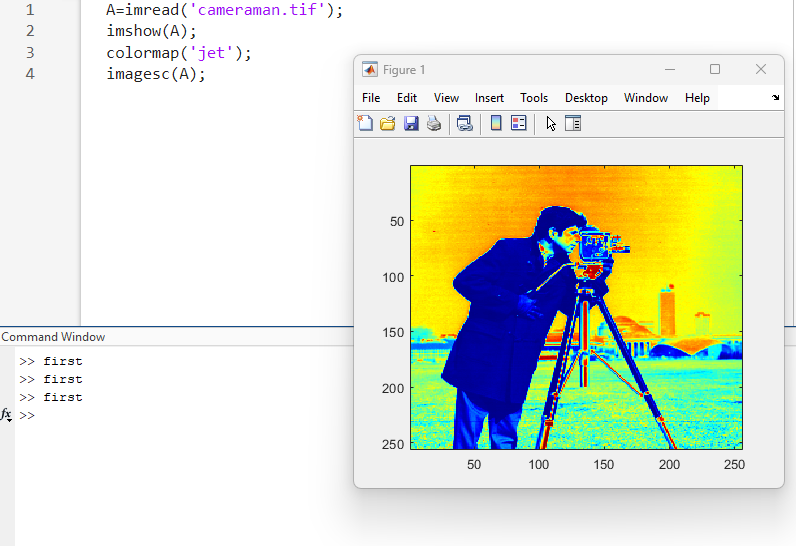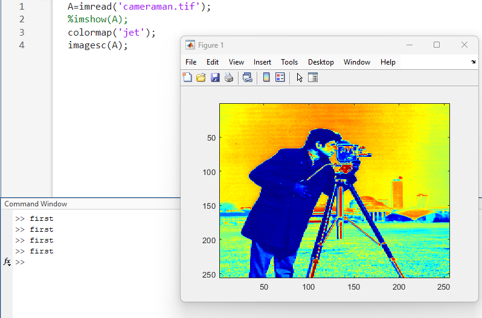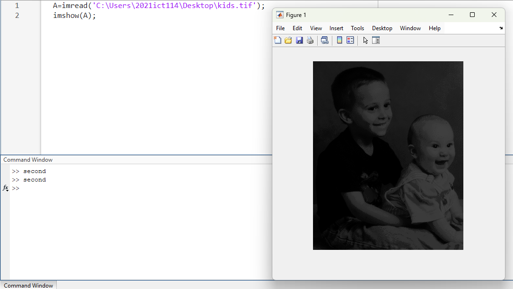|
|['second.m'](./Codes/second.m)|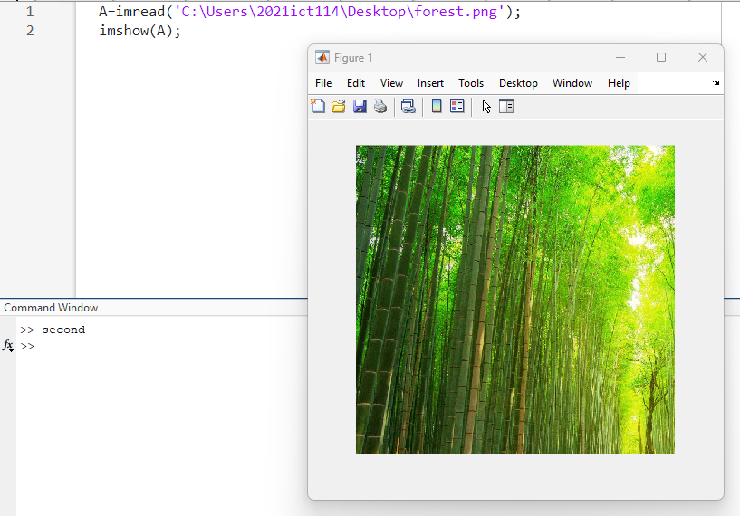|
|['third.m'](./Codes/third.m)|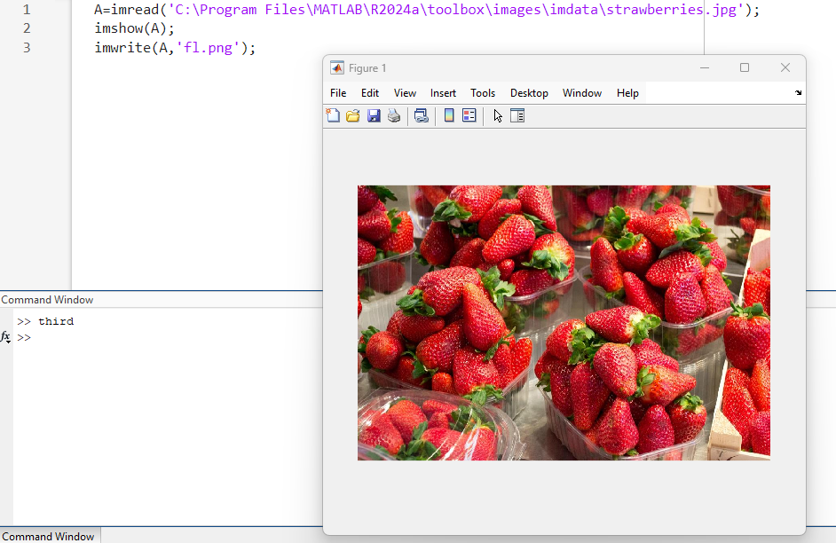|
|['fourth.m'](./Codes/fourth.m)|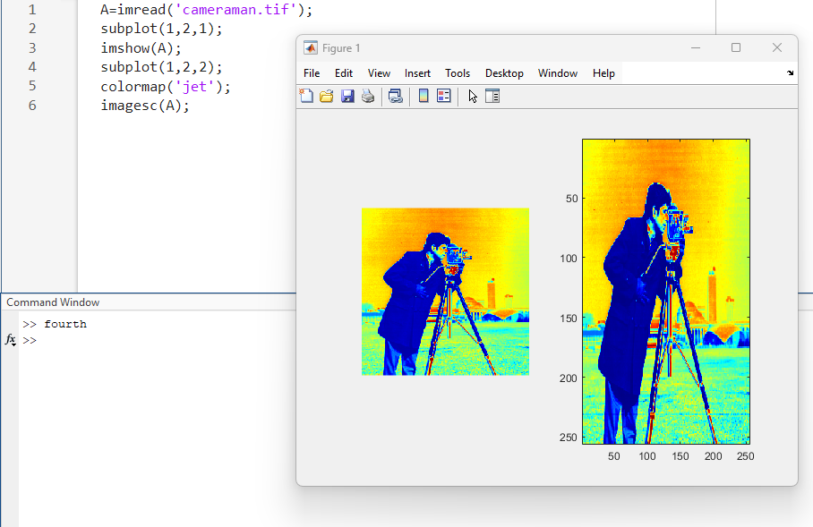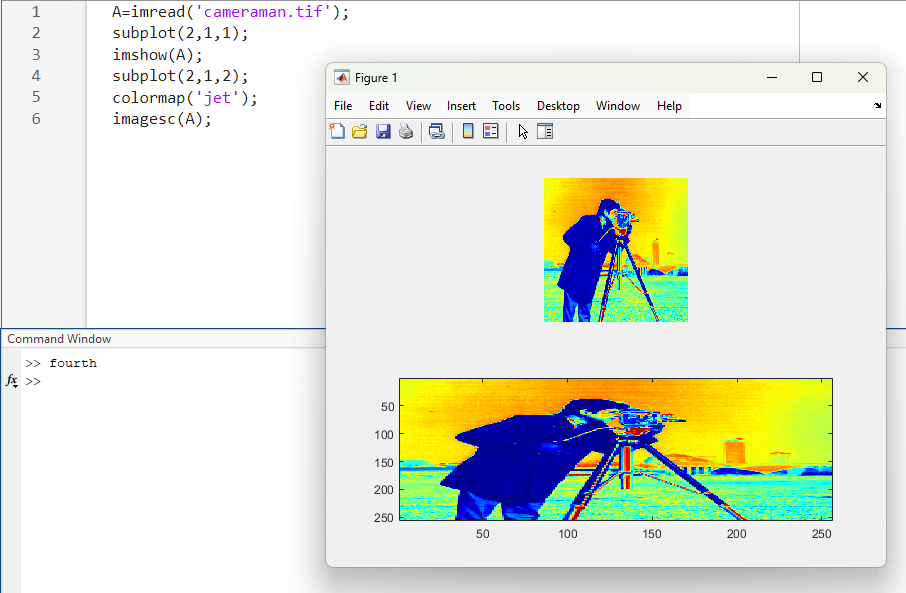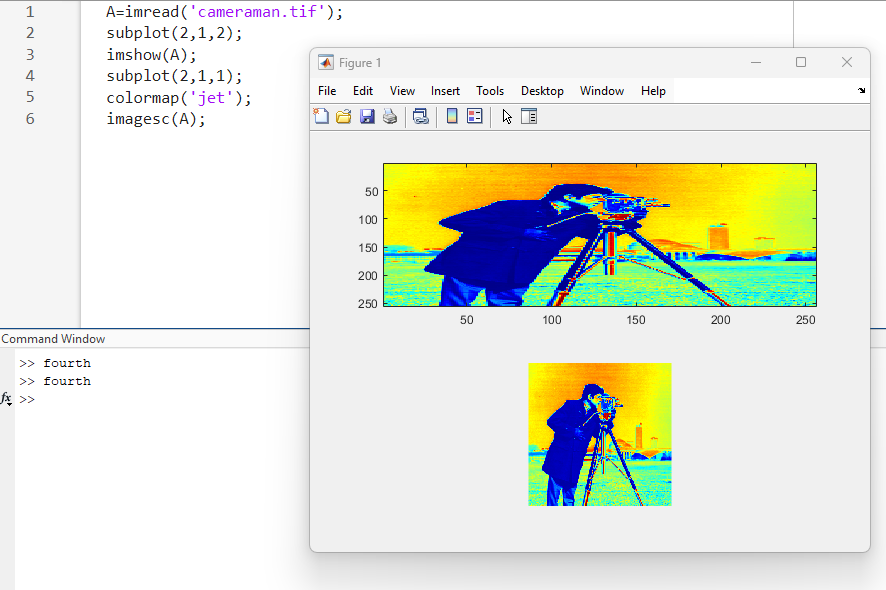|
|['fiveth.m'](./Codes/fiveth.m)|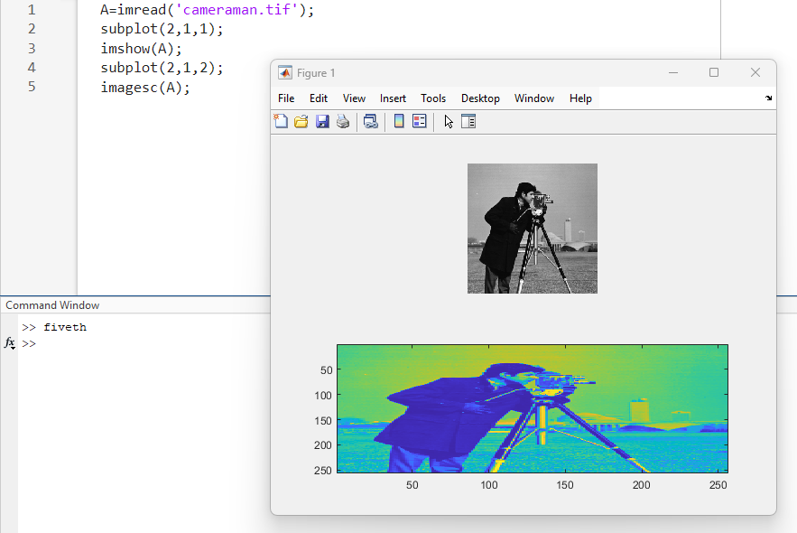|
|['sixth.m'](./Codes/sixth.m)|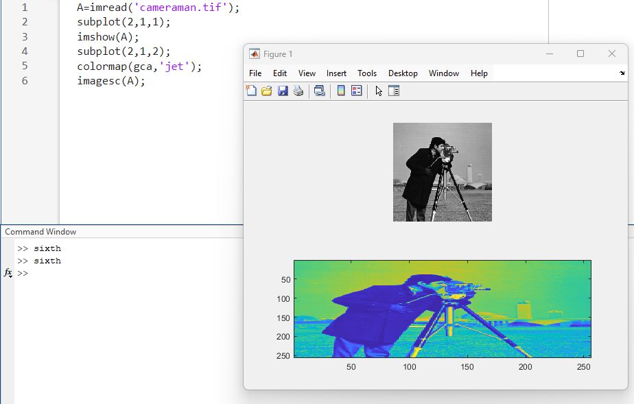|
|['seventh.m'](./Codes/seventh.m)|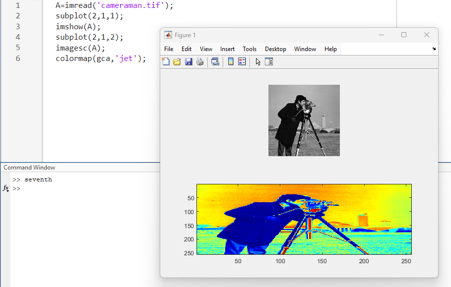|
|['eightth.m'](./Codes/eightth.m)|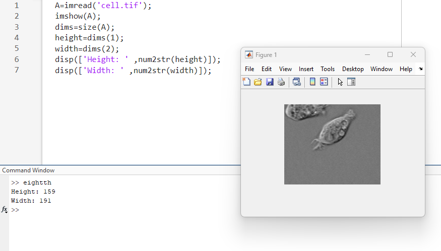|
|['nineth.m'](./Codes/nineth.m)|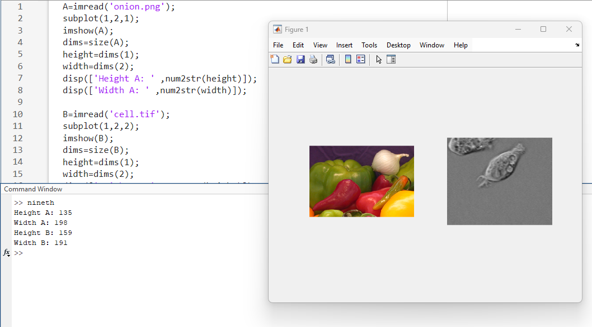|

