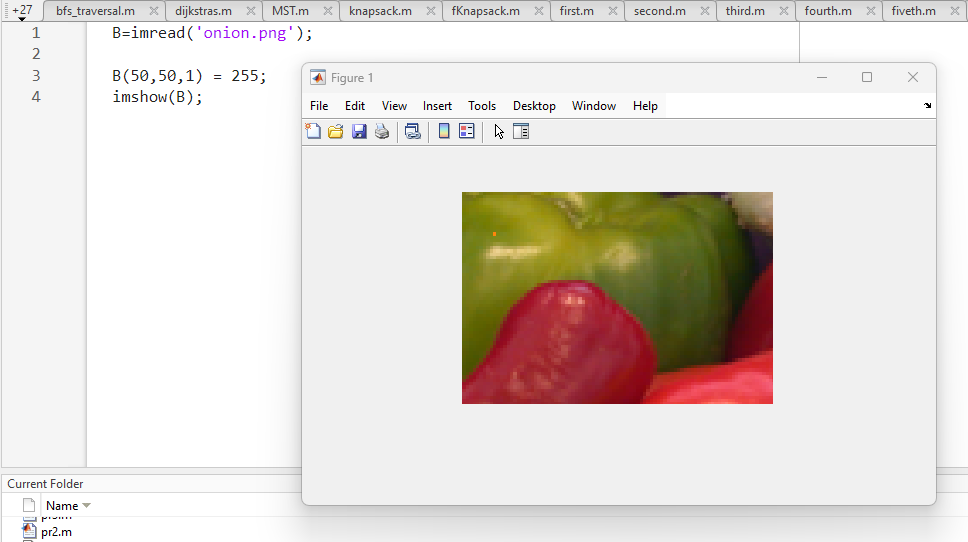
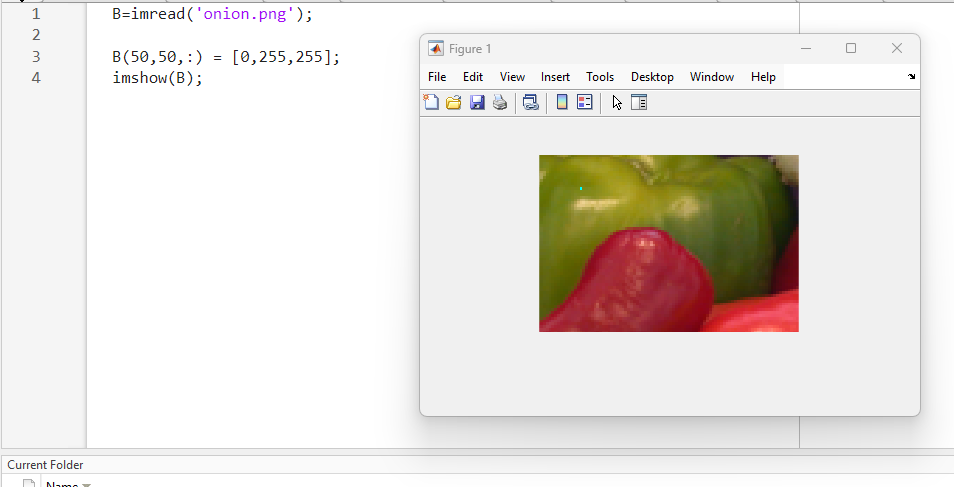
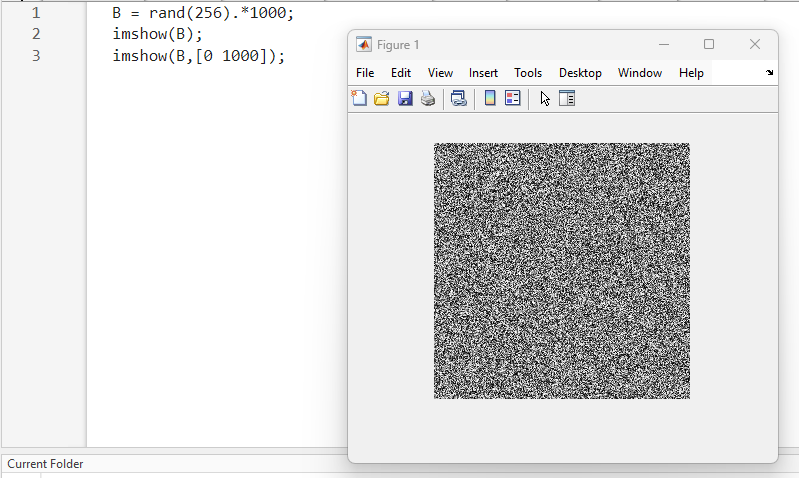
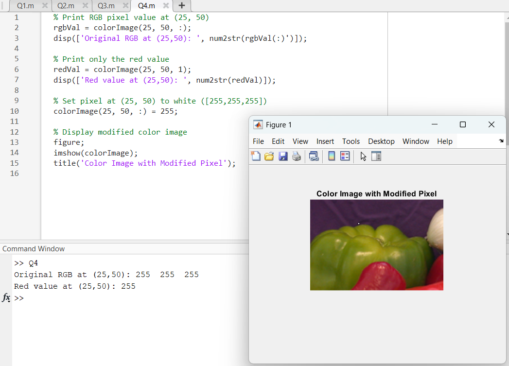

| Code Files | Outputs |
|------------|---------|
| ['pr1.m'](./Codes/pr1.m) |          |
| ['pr2.m'](./Codes/pr2.m) |    |
| ['pr3.m'](./Codes/pr3.m) |    |
| ['pr4.m'](./Codes/pr4.m) |   |
| ['pr5.m'](./Codes/pr5.m) |  |
| ['Tutorial.pdf'](./Codes/Tutorial.pdf)   ['Q1.m'](./Codes/Q1.m)   ['Q2.m'](./Codes/Q2.m)   ['Q3.m'](./Codes/Q3.m)   ['Q4.m'](./Codes/Q4.m)   ['Q5.m'](./Codes/Q5.m)   ['Q6.m'](./Codes/Q6.m) |       |

