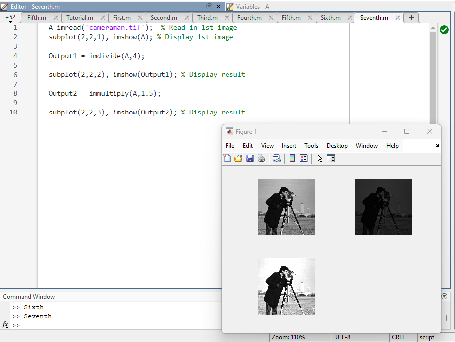

| Code Files | Outputs |
|------------|---------|
|['First.m'](./Codes/First.m)|
|['Second.m'](./Codes/Second.m)||
|['Third.m'](./Codes/Third.m)||
|['Fourth.m'](./Codes/Fourth.m)|
|['Fifth.m'](./Codes/Fifth.m)||
|['Sixth.m'](./Codes/Sixth.m)||
|['Seventh.m'](./Codes/Seventh.m)||
|['eighth.m'](./Codes/eighth.m)||
|['ninth.m'](./Codes/ninth.m)||
|['tenth.m'](./Codes/tenth.m)||
|['eleventh.m'](./Codes/eleventh.m)||

